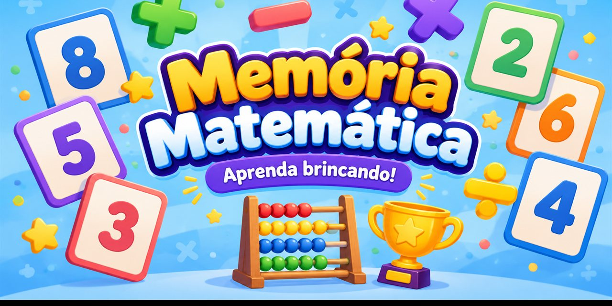

# 🧮 Memória Matemática

Um jogo educativo para crianças praticarem adição, subtração, multiplicação e divisão de uma forma divertida.

## Como jogar

Vire as cartas e encontre a conta com o resultado correto. Escolha o nível e as operações que deseja praticar.

## Jogar agora

[▶ Abrir o jogo](https://junioassis1.github.io/memoria-matematica/)
